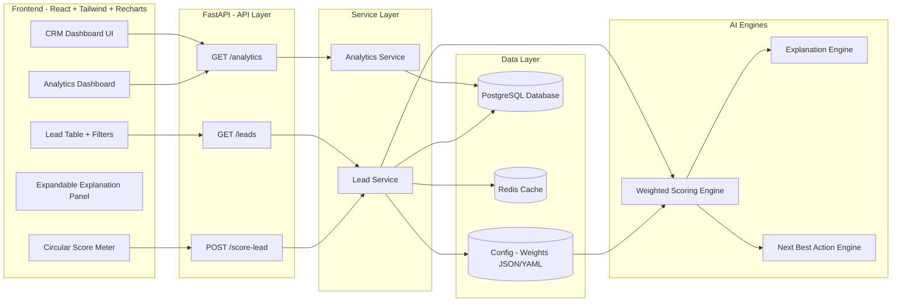

# CRM AI Agent

A comprehensive AI-powered Customer Relationship Management system with intelligent lead scoring, analysis, and actionable insights.

## 🏗️ Architecture Overview

```
┌─────────────────────────────────────────┐
│            FRONTEND LAYER               │
│   React + Vite + Tailwind CSS           │
│   (Analytics, Lead Management, UI)      │
└──────────────────┬──────────────────────┘
                   │
┌──────────────────▼──────────────────────┐
│            API LAYER (REST)             │
│   Flask Backend with FastAPI            │
│   (Health, Leads, Scoring Endpoints)    │
└──────────────────┬──────────────────────┘
                   │
┌──────────────────▼──────────────────────┐
│         BUSINESS LOGIC ENGINES           │
│  ┌─────────────────────────────────────┐ │
│  │ • Scoring Engine                    │ │
│  │ • Explanation Engine                │ │
│  │ • Next Action Engine                │ │
│  └─────────────────────────────────────┘ │
└──────────────────┬──────────────────────┘
                   │
┌──────────────────▼──────────────────────┐
│         DATABASE LAYER                  │
│   SQLAlchemy ORM + Relational DB        │
│   (Leads, Scores, Analytics)            │
└─────────────────────────────────────────┘
```

### Detailed Architecture Diagram



## ✨ Key Features

- **Intelligent Lead Scoring**: AI-powered scoring system with configurable weights
- **Lead Analysis**: Comprehensive lead information and historical tracking
- **Explainable AI**: Detailed explanations for scoring decisions
- **Next Action Engine**: Automated recommendations for next steps
- **Real-time Analytics**: Dashboard with KPIs and performance metrics
- **RESTful API**: Clean, documented API endpoints
- **Responsive UI**: Modern, user-friendly interface with Tailwind CSS
- **Docker Support**: Full containerization for easy deployment

## 🛠️ Tech Stack

### Frontend
- **React 18** - UI library
- **Vite** - Fast build tool and dev server
- **Tailwind CSS** - Utility-first CSS framework
- **PostCSS** - CSS processing

### Backend
- **Python 3.x** - Core language
- **Flask/FastAPI** - REST API framework
- **SQLAlchemy** - ORM for database operations
- **YAML** - Configuration management

### Infrastructure
- **Docker** - Containerization
- **Docker Compose** - Multi-container orchestration

## 📁 Project Structure

```
CRM_Ai_Agent/
├── backend/                 # Python backend application
│   ├── app/
│   │   ├── api/            # API endpoints
│   │   ├── core/           # Configuration and logging
│   │   ├── db/             # Database setup
│   │   ├── engines/        # Business logic engines
│   │   │   ├── scoring_engine.py
│   │   │   ├── explanation_engine.py
│   │   │   └── next_action_engine.py
│   │   ├── models/         # Data models
│   │   ├── services/       # Business services
│   │   └── main.py         # App entry point
│   ├── seed_data/          # Database seeding scripts
│   ├── requirements.txt    # Python dependencies
│   ├── Dockerfile          # Backend container config
│   └── run.py              # Application runner
├── frontend/               # React frontend application
│   ├── src/
│   │   ├── components/     # React components
│   │   ├── services/       # API services
│   │   ├── utils/          # Helper utilities
│   │   ├── styles/         # Global styles
│   │   └── App.jsx         # Main app component
│   ├── package.json        # Node dependencies
│   ├── tailwind.config.js  # Tailwind configuration
│   ├── vite.config.js      # Vite configuration
│   ├── Dockerfile          # Frontend container config
│   └── index.html          # HTML entry point
├── config/
│   └── scoring_weights.yaml    # Scoring configuration
├── docs/                   # Documentation files
│   ├── README.md
│   ├── ARCHITECTURE.md
│   ├── DEVELOPMENT.md
│   ├── API_EXAMPLES.md
│   └── ...
├── docker-compose.yml      # Multi-container setup
└── README.md              # This file
```

## 🚀 Getting Started

### Prerequisites
- Docker and Docker Compose (recommended)
- OR Node.js 16+ and Python 3.8+

### Quick Start with Docker

```bash
# Build and run all services
docker-compose up --build

# Frontend will be available at http://localhost:5173
# Backend API will be available at http://localhost:5000
```

### Local Development Setup

#### Backend Setup
```bash
cd backend

# Create virtual environment
python -m venv venv
source venv/bin/activate  # On Windows: venv\Scripts\activate

# Install dependencies
pip install -r requirements.txt

# Run the application
python run.py
```

#### Frontend Setup
```bash
cd frontend

# Install dependencies
npm install

# Start development server
npm run dev

# Build for production
npm run build
```

## 📡 API Endpoints

### Health Check
- `GET /api/health` - Check API status

### Leads
- `GET /api/leads` - Get all leads
- `POST /api/leads` - Create new lead
- `GET /api/leads/{id}` - Get lead details
- `PUT /api/leads/{id}` - Update lead
- `DELETE /api/leads/{id}` - Delete lead

### Scoring
- `POST /api/leads/{id}/score` - Calculate lead score
- `GET /api/leads/{id}/score` - Get lead score
- `GET /api/leads/{id}/explanation` - Get scoring explanation

## 🎯 Scoring Engine Features

The scoring engine evaluates leads based on:
- Lead quality indicators
- Engagement metrics
- Conversion potential
- Custom weights (configurable in `config/scoring_weights.yaml`)

Each score includes:
- **Numeric Score** (0-100)
- **Explanation** - Why the score was assigned
- **Next Action** - Recommended next steps

## 📊 Dashboard Analytics

The frontend dashboard provides:
- Real-time KPIs
- Lead score distribution
- Performance metrics
- Lead management interface
- Score explanation interface

## 🔧 Configuration

### Scoring Weights
Edit `config/scoring_weights.yaml` to adjust how leads are scored:
```yaml
weights:
  engagement: 0.3
  quality: 0.4
  conversion_potential: 0.3
```

### Environment Variables
Configure backend via environment variables or `.env` file:
- `DATABASE_URL` - Database connection string
- `API_PORT` - API server port (default: 5000)
- `LOG_LEVEL` - Logging level (default: INFO)

## 📚 Documentation

For more detailed information, see:
- [ARCHITECTURE.md](docs/ARCHITECTURE.md) - System architecture details
- [DEVELOPMENT.md](docs/DEVELOPMENT.md) - Development guidelines
- [API_EXAMPLES.md](docs/API_EXAMPLES.md) - API usage examples
- [EXECUTIVE_SUMMARY.md](docs/EXECUTIVE_SUMMARY.md) - Project overview
- [FILE_INVENTORY.md](docs/FILE_INVENTORY.md) - Complete file reference

## 🤝 Contributing

1. Create a feature branch (`git checkout -b feature/amazing-feature`)
2. Commit your changes (`git commit -m 'Add amazing feature'`)
3. Push to the branch (`git push origin feature/amazing-feature`)
4. Open a Pull Request

## 📝 License

This project is licensed under the MIT License - see the [LICENSE](LICENSE) file for details.

## 📞 Support

For issues, questions, or suggestions, please refer to the documentation in the `docs/` folder or create an issue in the repository.

---

**Built with ❤️ using Python, React, and modern web technologies**
